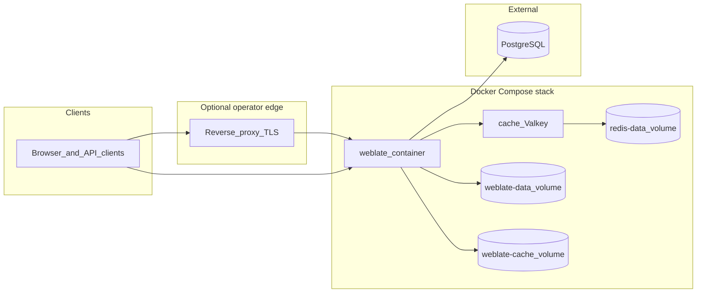

# Deployment overview

This document describes what the Boost Weblate Docker Compose stack covers, how its pieces fit together, and how operations should record environment-specific details. For procedural steps (setup, health checks, rollback), see [deployment-runbook.md](deployment-runbook.md).

## Scope

**In scope**

- Running Boost Weblate from this repository’s [`docker-compose.yml`](../docker-compose.yml): **Valkey** (`cache` service), the **Weblate application** container (`weblate`), and **Docker volumes** for application data and caches.
- Configuration via an `environment` file (copy from [`environment.example`](../environment.example)), consistent with [upstream Weblate Docker environment variables](https://docs.weblate.org/en/latest/admin/install/docker.html#generic-settings).
- **PostgreSQL** as a database **outside** this Compose file by default (see `POSTGRES_*` in `environment.example`). You provide connectivity from the Weblate container (for example `host.docker.internal` on Docker Desktop–style hosts).

**Out of scope (operator-owned)**

- TLS termination, reverse proxies, load balancers, CDN, and DNS in front of the stack.
- Hosting and backup policy for PostgreSQL itself (only the connection expectations from Weblate’s perspective are described here).
- Organization-specific monitoring, paging, and incident management beyond the health endpoints this image exposes.

## Repository layout

Git **repository names** are **`weblate`** (application fork) and **`weblate-docker`** (this repository). The directory you clone into is independent—often named after the deployment (for example **`boost-weblate`** on disk).

| Git repository | Checkout folder (example) | Role |
|----------------|---------------------------|------|
| **`weblate`** | e.g. `boost-weblate/` | Application sources copied into the image at build time (`COPY .. /app/boost-weblate/` in the Dockerfile). |
| **`weblate-docker`** | **`weblate-docker/`** submodule inside that tree | Dockerfile, Compose, nginx/supervisor layout, patches (this repo). |

[`docker-compose.yml`](../docker-compose.yml) sets `build.context` to the **parent directory** and `dockerfile: weblate-docker/Dockerfile`, so the application root **must** contain **`weblate-docker/`** next to the Python tree.

**Submodule workflow (typical)**

```bash
git clone --recurse-submodules <weblate-repo-url> boost-weblate
cd boost-weblate
# If submodules were not initialized:
git submodule update --init weblate-docker
```

**Equivalent manual layout** (folder name `boost-weblate` is only an example)

```
boost-weblate/          # clone of repo `weblate` — Docker build context ..
  weblate-docker/       # clone / submodule of repo `weblate-docker`
    docker-compose.yml
    Dockerfile
    ...
```

Run Compose from `<application-root>/weblate-docker/` (for example `boost-weblate/weblate-docker/`).

### Automated deploy (reference)

The **`weblate`** application repository defines CD in **`.github/workflows/cd.yml`**. That workflow deploys over SSH into **`/opt/boost-weblate`** on the server: `git pull`, `git submodule update --init weblate-docker`, copies **`weblate-docker/.dockerignore`** to the application root for the Docker build context, then runs **`docker compose down`** and **`docker compose up -d --build`** from **`weblate-docker/`**, and finally probes **`http://localhost:8000/healthz/`** after a startup wait. If your checkout path or workflow differs, follow your fork’s YAML—this section describes the intended shape.

## Components



- **`weblate` service:** nginx + Django + Celery workers (supervisor). Exposes **8080** inside the container; the sample Compose maps **8000:8080** on the host.
- **`cache` service:** Valkey for Redis-compatible caching (`REDIS_HOST=cache` in `environment.example`).
- **Volumes:** Persistent Weblate data under `/app/data`, cache under `/app/cache`, Valkey data for the cache service.

Fork-specific behaviour (QuickBook, AsciiDoc, OpenRouter translation, `/boost-endpoint/`, and related settings) is documented in the Boost Weblate additions chapter—see [References](#references).

## Environments

Replace placeholders with values for your organization. Do not commit real secrets.

| Environment | Purpose | Public URL | Image tag / digest strategy | PostgreSQL endpoint (label) | Notes |
|-------------|---------|------------|------------------------------|-----------------------------|-------|
| Development | _TBD_ | _TBD_ | _e.g. Compose `image` + git SHA_ | _TBD_ | _TBD_ |
| Staging | _TBD_ | _TBD_ | _TBD_ | _TBD_ | _TBD_ |
| Production | _TBD_ | _TBD_ | _TBD_ | _TBD_ | _TBD_ |

## Operations handoff checklist

Use this when transferring ownership or onboarding on-call engineers.

- [ ] **Service owner** and **escalation path** (team, chat channel, ticket queue).
- [ ] **Source of truth** for deploys: for example the **`weblate`** repo’s **`.github/workflows/cd.yml`** (`workflow_dispatch` over SSH), a registry image workflow, or manual `docker compose build` from tagged revisions. Record the server checkout path (for example **`/opt/boost-weblate`**).
- [ ] **Secrets:** `environment` file (not committed), or Docker secrets / `_FILE` variables as supported by [`start`](../start). Document where credentials are stored (vault, password manager, cloud secret store).
- [ ] **Database:** Who operates PostgreSQL, backup schedule, restore drill procedure. Link to [Weblate backup documentation](https://docs.weblate.org/en/latest/admin/backup.html).
- [ ] **Monitoring:** Health endpoint `/healthz/` (see [deployment-runbook.md](deployment-runbook.md)), optional `SENTRY_DSN` / `SENTRY_ENVIRONMENT` in `environment.example`.
- [ ] **Mail and integrations:** SMTP (`WEBLATE_EMAIL_*`), VCS credentials (`WEBLATE_GITHUB_*`, etc.) as required.
- [ ] **Boost fork options:** OpenRouter and related env vars—see [References](#references).

## References

- **Runbook:** [deployment-runbook.md](deployment-runbook.md)
- **Weblate (upstream):** [Docker installation](https://docs.weblate.org/en/latest/admin/install/docker.html), [Backup](https://docs.weblate.org/en/latest/admin/backup.html), [Upgrading](https://docs.weblate.org/en/latest/admin/upgrade.html)
- **Boost Weblate fork:** `docs/admin/boost-weblate.rst` in the **`weblate`** repository (Sphinx source for fork-specific configuration and HTTP APIs). Your checkout directory may use another name (for example **`boost-weblate`**). Use your project’s published docs URL if available.
